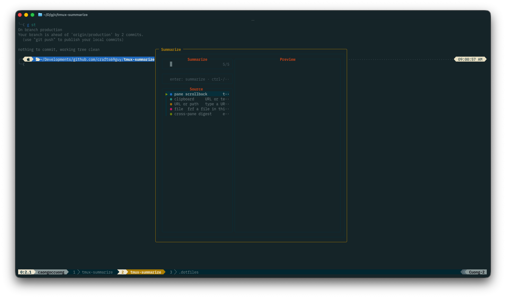
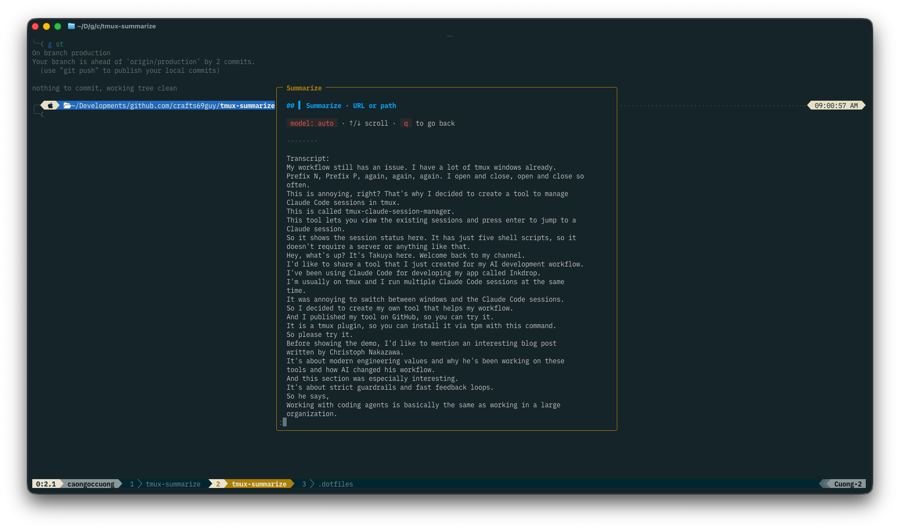

# tmux-summarize

Summarize the context you already have in tmux with
[`@steipete/summarize`](https://github.com/steipete/summarize), streamed into a
popup (or split pane) — no copy-pasting into a browser.

From a single menu (`prefix + S`) you can summarize:

- **Current pane scrollback** — long logs, build output, a stack trace.
- **Clipboard / copy-mode selection** — a URL, article text, a YouTube link.
- **A typed URL or path**, or an fzf-picked file (PDFs, docs, audio, video).
- **A cross-pane digest** — every pane in the window/session at once.

The summary runs through a login shell, so it inherits your normal environment
(API keys, and any `OPENAI_BASE_URL` for routing through a local proxy like
[9router](https://github.com/decolua/9router)) — see
[Routing](#routing-through-9router-or-any-openai-compatible-proxy).

## Demo

`prefix + S` opens a filterable fzf picker with a live preview — choose a source:

<p align="center">
  
</p>

…and the summary is rendered (glow) into a centred, scrollable paper column:

<p align="center">
  
</p>

> Want an animated walkthrough instead? See [`docs/README.md`](docs/README.md)
> to record a `docs/demo.gif` (e.g. with [`vhs`](https://github.com/charmbracelet/vhs)).

## Requirements

- [`summarize`](https://github.com/steipete/summarize) on `PATH`
  (`brew install summarize` or `npm i -g @steipete/summarize`, Node 24+).
- tmux ≥ 3.2 (`display-menu` / `display-popup`).
- `fzf` (+ `fd` recommended) for the source picker and file picker; `bat` for
  file previews. (Set `@summarize_picker 'menu'` to skip fzf and use the key-menu.)
- At least one model provider configured for `summarize` (env var or
  `~/.summarize/config.json`).

## Install

With [TPM](https://github.com/tmux-plugins/tpm), add to `tmux.conf`:

```tmux
set -g @plugin 'crafts69guy/tmux-summarize'
```

Then `prefix + I` to install. Manually: clone the repo and
`run-shell /path/to/summarize.tmux`.

## Usage

Press **`prefix + S`**. By default this opens a themed **fzf source picker** with
a live preview of what each source would summarize — type to filter, `ctrl-/`
toggles the preview, `enter` runs:

| Source | What it summarizes |
|--------|--------------------|
| pane scrollback | the current pane's output |
| clipboard | a URL or text on the clipboard / copy-mode selection |
| URL or path | a URL/path you type |
| pick a file | an fzf-picked file (with `bat` preview) |
| cross-pane digest | every pane in the window (or session) |

The summary streams **into the same popup**; press **Enter** to close it.

Prefer keys over fzf? Set `@summarize_picker 'menu'` for a quick themed key-menu
(`p`/`c`/`i`/`d`). Either way, the direct-key path and menu honor
`@summarize_output` (`popup` default, or `split` for a persistent pane).

## Options

All options use the `@summarize_*` namespace. Set them in `tmux.conf`.

| Option | Default | Description |
|--------|---------|-------------|
| `@summarize_menu_key` | `S` | Prefix key that opens the picker/menu |
| `@summarize_picker` | `fzf` | `fzf` source-picker, or `menu` key-menu |
| `@summarize_command` | `summarize` | CLI to invoke (e.g. a wrapper/shim) |
| `@summarize_model` | *(unset)* | `--model provider/model`; unset → summarize decides |
| `@summarize_length` | *(unset)* | `--length short\|medium\|long\|xl\|xxl` |
| `@summarize_language` | *(unset)* | `--language <lang>` |
| `@summarize_extra_args` | *(unset)* | Raw flags appended verbatim |
| `@summarize_output` | `popup` | Where output goes: `popup` or `split` |
| `@summarize_shell` | *(tmux `default-shell`)* | Login shell the popup runs through (loads your env) |
| `@summarize_popup_width` | *(paper: `wrap`+8 cols)* | Popup width (when `output = popup`); defaults to a centred paper column |
| `@summarize_popup_height` | `80%` | Popup height (when `output = popup`) |
| `@summarize_wrap` | `80` | Word-wrap column for the rendered summary (the "paper" width) |
| `@summarize_split` | `h` | Split direction `h`/`v` (when `output = split`) |
| `@summarize_split_size` | `40%` | Split size (when `output = split`) |
| `@summarize_pane_lines` | `2000` | Scrollback to capture (`-` = all, or a number) |
| `@summarize_digest_scope` | `window` | `window` or `session` |
| `@summarize_pane_key` `@summarize_clip_key` `@summarize_input_key` `@summarize_digest_key` | *(unset)* | Optional direct bindings that skip the picker |

### Picker & theming (Solarized Osaka defaults)

| Option | Default | Description |
|--------|---------|-------------|
| `@summarize_fzf_opts` | *(unset)* | Extra fzf flags, appended last (override anything) |
| `@summarize_preview_window` | `right,60%,wrap` | fzf preview window for the picker/file picker |
| `@summarize_border_lines` | `rounded` | Popup/menu border (`rounded`/`single`/`double`/…) |
| `@summarize_border_style` | `fg=#b58900` | Popup/menu border style (yellow accent) |
| `@summarize_title` | `#[fg=#b58900,bold] Summarize ` | Popup/menu title |
| `@summarize_render` | `auto` | Pretty-render the summary: `auto` (glow → bat → raw), `glow`, `bat`, or `none` |
| `@summarize_pager` | `on` | Show the popup summary in a scrollable pager; `off` for a static read-hold |
| `@summarize_accent_color` | `136` | 256-colour accent for the summary header/footer (Osaka yellow) |
| `@summarize_dim_color` | `240` | 256-colour dim for header labels |
| `@summarize_menu_style` | `fg=#839496,bg=#002b36` | Body style (`menu` picker only) |
| `@summarize_menu_selected` | `fg=#002b36,bg=#b58900,bold` | Selected row (`menu` picker only) |

The fzf picker inherits your `FZF_DEFAULT_OPTS` theme automatically (only the
layout is pinned), so it matches the rest of your fzf UI out of the box.

By default the summary is rendered through [`glow`](https://github.com/charmbracelet/glow)
(or `bat` if glow is absent) for formatted Markdown, shown in a **scrollable
pager** — a tmux popup has no scrollback of its own, so without a pager a long
summary would scroll off and be unreachable. Use **↑/↓ or `j`/`k`** to scroll and
**`q`** to go back (close the popup). Set `@summarize_pager 'off'` for a static
view (press Enter to close, no scrolling), or `@summarize_render 'none'` for raw,
unrendered output. The `split` output (`@summarize_output 'split'`) uses a normal
pane, which already scrolls via tmux copy-mode (`prefix + [`).

The popup defaults to a **centred paper column** (`@summarize_wrap`+8 columns wide,
80+8 by default) so the text fills it and sits centred on screen instead of hugging
the left of a full-width popup. Make the page narrower or wider with
`@summarize_wrap` (e.g. `set -g @summarize_wrap '72'`), or set an explicit
`@summarize_popup_width` to override the paper sizing entirely.

Because the renderer buffers, the summary appears once it finishes rather than
streaming token by token.

Example:

```tmux
set -g @plugin 'crafts69guy/tmux-summarize'
set -g @summarize_length 'medium'
set -g @summarize_split_size '45%'
set -g @summarize_pane_key 'M-s'   # prefix+M-s → summarize pane directly
# set -g @summarize_picker 'menu'  # prefer the quick key-menu over fzf
```

## Routing through 9router (or any OpenAI-compatible proxy)

`summarize` honours `OPENAI_BASE_URL`, so you can route summaries through a local
proxy such as [9router](https://github.com/decolua/9router) to use cheap/free
model tiers instead of burning a raw API key. The plugin is unopinionated about
this — it just inherits your shell environment. Configure routing in your shell
rc (keep keys out of version control), e.g. for fish:

```fish
# ~/.config/fish/config-local.fish  (untracked)
set -gx OPENAI_BASE_URL http://localhost:20128/v1
set -gx OPENAI_API_KEY  <your-9router-key>
```

and point the plugin at a 9router combo:

```tmux
set -g @summarize_model 'openai/cc/claude-opus-4-7'
```

With nothing set, `summarize` falls back to whatever provider is configured in
its own env/`~/.summarize/config.json`.

## Tests

```bash
./tests/run.sh
```

Pure helpers (`build_args`, `is_url`, `shq`, `get_opt`) are tested with a stubbed
tmux — no external framework required.

## License

MIT
